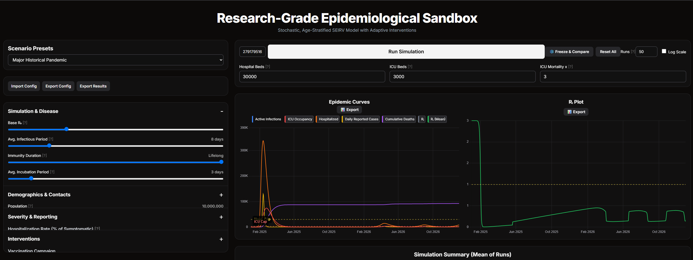

# Research-Grade Epidemiological Sandbox (RGES)

[Access RGES](https://disease-ten.vercel.app/)

## Overview

The **Research-Grade Epidemiological Sandbox (RGES)** is an interactive web-based tool for simulating and analyzing the spread of infectious diseases. It runs entirely in the browser using **HTML, JavaScript, and Chart.js**, requiring no installation.

RGES is built on a stochastic, age-stratified **SEIRV (Susceptible, Exposed, Infectious, Recovered, Vaccinated)** model, enabling exploration of:

* Disease dynamics across populations
* Intervention strategies (vaccination campaigns, NPIs)
* Visualization of epidemic curves and effective reproduction number (Rₜ)

It includes scenario presets (COVID-19, seasonal flu) and allows customization of parameters such as **R₀, contact matrices, and hospital capacity**.

---

## ✨ Features

* **Stochastic Simulations**: Capture variability across multiple runs.
* **Age-Stratified Model**: Three groups (0–19, 20–64, 65+) with customizable contact/severity rates.
* **Adaptive Interventions**: Vaccination and NPIs triggered by ICU thresholds.
* **Interactive Charts**: Epidemic curves and Rₜ plots with confidence intervals.
* **Configurable Parameters**: Disease dynamics, demographics, interventions, and more.
* **Export Tools**: Save results/configs as JSON, download charts as PNG.
* **Freeze & Compare**: Compare multiple runs side by side.
* **Responsive UI**: Dark-themed, works on desktop and mobile.

---

## Getting Started

1. Open the tool here: [disease-ten.vercel.app](https://disease-ten.vercel.app/)
2. Choose a preset scenario or configure your own parameters.
3. Run simulations and view results in real-time charts.
4. Export or compare results as needed.

---

## License

This project is intended for **educational and research purposes only**. Not for medical decision-making.
